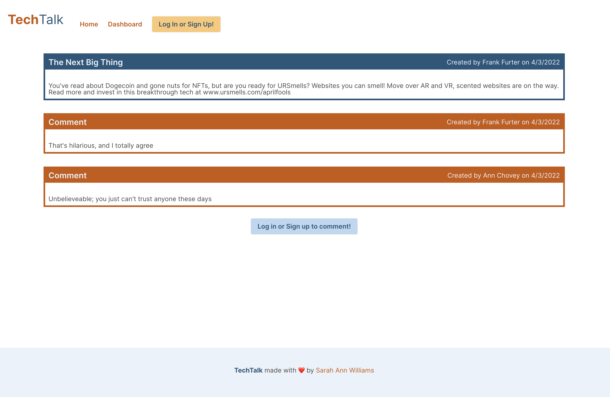

# 14: "TechTalk" Tech Blog

#### Licensed under [MIT](LICENSE)

## Table of Contents

- [Project Description](#project-description)
- [Usage](#usage-instructions)
- [Tests](#tests)
- [Links](#links)

## Project Description

This website utilizes a Sequelize, Express, Handlebars, Node stack to run a tech blog. Additional npm packages include MySQL2 (for MySQLWorkbench), Express-session (for cookies), .env (for database privacy), and bcrypt (for user password privacy)

## Usage Instructions

Click the Heroku link below to open TechTalk in your browser, and explore the user-interactive goodness

Without an account, users can read blog posts from other users. By clicking on a blog post, they can also view any comments that have been added

 

Users can create an account or log in to gain access to additional website features

With an account, users can add their own blog posts and comment on other users' posts. Don't like your post? Update or Delete it! 

 

TechTalk has a mobile-responsive design, and remains visually appealing whether you are on desktop, tablet, or phone

## Tests
Test this program by clicking links, and entering unexpected or no text into inputs

## Links

- Repository: https://github.com/Sarahlophus/tech-talk
- Live page (Heroku): https://techtalk-blog.herokuapp.com/
